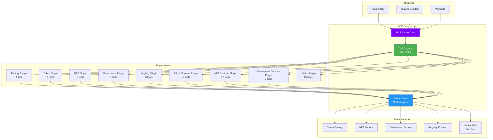
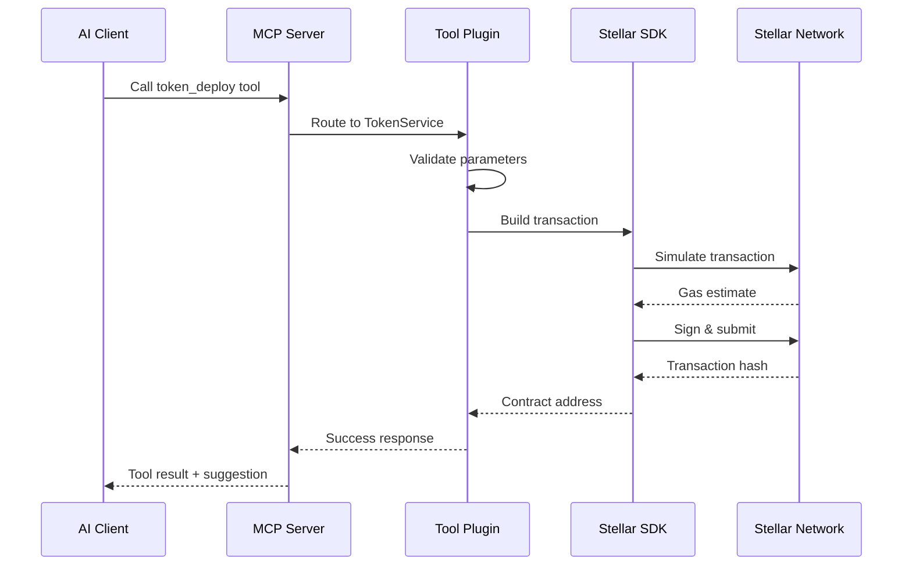

<div align="center">


# Stellar Studio MCP Server

**Model Context Protocol Backend for Stellar Smart Contracts**

AI-powered blockchain operations through conversational interface

[](LICENSE)
[](https://www.typescriptlang.org/)
[](https://modelcontextprotocol.io)

[Quick Start](#quick-start) • [Architecture](#architecture) • [Usage Examples](#usage-examples) • [Tools](#tool-reference)

</div>

---

## Overview

A Model Context Protocol (MCP) server that enables AI assistants to interact with the Stellar blockchain through natural language commands. The server provides comprehensive smart contract deployment, token operations, NFT management, governance, and registry tools for building Stellar dApps conversationally.

**What It Does:**
- Exposes 80+ blockchain operations as MCP tools
- Manages factory contract interactions (Token, NFT, Governance)
- Handles transaction building, simulation, and signing
- Generates merkle proofs for governance voting
- Provides contract deployment utilities and registry integration

**What It Powers:**
- AI chat interfaces (Cursor, Claude Desktop, VS Code)
- Natural language blockchain operations
- Automated contract deployment workflows
- Blockchain data queries through conversation

---

## Table of Contents

- [Architecture](#architecture)
- [Features](#features)
- [Quick Start](#quick-start)
  - [Automated Setup](#automated-setup-recommended)
  - [Manual Configuration](#manual-configuration-alternative)
- [Usage Examples](#usage-examples)
- [Tool Reference](#tool-reference)
- [Development](#development)
- [Testing](#testing)
- [Security](#security-considerations)

---

## Architecture

### System Design



### Tool Execution Flow



### Plugin Architecture

The server uses a modular plugin system for organizing tools by domain:

**Factory Plugin** (1 tool):
- Factory contract deployment tracking

**Token Plugin** (5 tools):
- Token deployment via TokenFactory
- Factory queries (count, list, filter by type/admin)

**NFT Plugin** (5 tools):
- NFT collection deployment via NFTFactory
- Factory queries (count, list, filter by type/owner)

**Governance Plugin** (5 tools):
- Governance deployment via GovernanceFactory
- Factory queries (count, list, filter by type/admin)

**Registry Plugin** (6 tools):
- Publish compiled contracts to Stellar Registry
- Deploy published contracts from registry
- Create aliases for deployed contracts
- Query registry for published contracts and versions

**Token Contract Plugin** (15 tools):
- Token query operations (name, symbol, balance, allowance, etc.)
- Token transaction operations (transfer, mint, burn, pause, etc.)

**NFT Contract Plugin** (17 tools):
- NFT query operations (owner, balance, metadata, etc.)
- NFT transaction operations (mint, transfer, burn, approve, etc.)

**Governance Contract Plugin** (3 tools):
- Vote casting with merkle proofs
- Vote status checking
- Vote results retrieval

**Utilities Plugin** (15 tools):
- Merkle tree generation and validation
- Configuration builders
- Address validation
- Amount formatting
- Salt generation

**Total: 80+ Tools**

## Features

### Smart Contract Deployment
- **Token Factory**: Deploy Pausable, Capped, Allowlist, Blocklist, or Vault tokens
- **NFT Factory**: Deploy Enumerable or AccessControl NFT collections
- **Governance Factory**: Deploy MerkleVoting governance contracts
- **Registry Integration**: Publish and deploy contracts through Stellar Registry

### Token Operations
- **Token Transfers**: Native and fungible token operations
- **Balance Queries**: Real-time account balance monitoring
- **Token Management**: Minting, burning, pausing capabilities
- **Approval System**: Allowance and delegation management

### NFT Operations
- **Collection Management**: Complete NFT lifecycle operations
- **Metadata Handling**: Token URI and metadata management
- **Transfer Operations**: Secure ownership transfers
- **Approval System**: Individual and operator approvals

### Governance Operations
- **Merkle Voting**: Privacy-preserving vote casting
- **Vote Tracking**: Real-time vote status and results
- **Proof Generation**: Automatic merkle proof creation

### Registry Operations
- **Contract Publishing**: Publish compiled WASM to registry
- **Version Management**: Track and deploy specific versions
- **Alias System**: Create named references to contracts
- **Discovery**: List and query published contracts

### Utility Functions
- **Merkle Trees**: Generate complete merkle trees with proofs
- **Validation**: Address and configuration validation
- **Builders**: Quick configuration builders for common patterns
- **Formatting**: Amount conversion between human and contract formats

## Quick Start

### Prerequisites

- Claude Desktop, Cursor, or VS Code with MCP support
- Node.js 18 or higher
- pnpm package manager
- Stellar account with funded balance (testnet or mainnet)

### Installation

1. **Clone and build the server**
   ```bash
   cd stellar-studio-mcp-server
   pnpm install
   pnpm build
   ```

2. **Configure environment variables**
   ```bash
   cp .env.testnet .env
   # Edit .env with your Stellar secret key
   ```

   Generate a Stellar secret key:
   ```bash
   stellar keys generate my-key
   stellar keys show my-key
   ```

3. **Automated Setup (Recommended)**

   Use the automated setup script to configure your preferred AI application:

   ```bash
   # Interactive mode - choose which application to configure
   pnpm setup:claude

   # Or configure specific applications
   pnpm setup:cursor    # Configure Cursor editor
   pnpm setup:code      # Configure VS Code

   # Or use the script directly for multiple applications
   ./setup-mcp.sh --claude --cursor
   ```

   The setup script will:
   - Read your `.env` configuration
   - Generate the appropriate MCP configuration
   - Install it in the correct location for your chosen application(s)
   - Provide restart instructions

4. **Manual Configuration (Alternative)**

   If you prefer manual setup, you can configure the applications directly:

   **Claude Desktop**: `~/Library/Application Support/Claude/claude_desktop_config.json`

   **Cursor Editor**: `~/.cursor/mcp.json`

   **VS Code**: `~/Library/Application Support/Code/User/mcp.json`

   Example configuration:
   ```json
   {
     "mcpServers": {
       "stellar-studio": {
         "command": "node",
         "args": ["/absolute/path/to/stellar-studio-mcp-server/dist/index.js"],
         "env": {
           "STELLAR_SECRET_KEY": "SD...",
           "STELLAR_NETWORK": "testnet"
         }
       }
     }
   }
   ```

5. **Restart your AI application**

   Close and reopen Claude Desktop, Cursor, or VS Code to load the MCP server.

### Environment Configuration

| Variable | Required | Description |
|----------|----------|-------------|
| `STELLAR_SECRET_KEY` | Yes | Your Stellar secret key (starts with SD) |
| `STELLAR_NETWORK` | Yes | Network: `local`, `testnet`, or `mainnet` |
| `TOKEN_FACTORY` | Auto | Token factory contract address (auto-configured) |
| `NFT_FACTORY` | Auto | NFT factory contract address (auto-configured) |
| `GOVERNANCE_FACTORY` | Auto | Governance factory contract address (auto-configured) |

**Factory Addresses (Testnet):**
```bash
TOKEN_FACTORY=CAHLJEQUCNTV7JPAPCMLCBIHOX7FFB57DUARJ6XGTW27FPCVKKY7JM2A
NFT_FACTORY=CDJQAGTVOK37NPBWMADBJDGFYM6BEAFV4T45S23D4LQLGSTMRRZ5RQ6X
GOVERNANCE_FACTORY=CC3SLHSCJHP7YJ462ZIACJ54VOHL5ZFUODZKBTITIZSO74D4YOPR5WCE
```

### Network Switching

```bash
# Switch to testnet
cp .env.testnet .env
pnpm build
./setup-mcp.sh --claude

# Switch to local development
cp .env.local .env
pnpm build
./setup-mcp.sh --claude
```

## Usage Examples

### Token Operations
```
"Deploy a new token named MyToken with symbol MTK and 1 million initial supply"
"Get the balance of my MTK tokens"
"Transfer 1000 MTK tokens to GA2C..."
"Mint 50000 MTK tokens to my address"
"Get all deployed tokens from the factory"
"Show me all Pausable tokens"
```

### NFT Operations
```
"Deploy a new NFT collection called CoolNFTs with symbol COOL"
"Mint an NFT in my collection at CA..."
"Transfer NFT #5 from my collection to GB..."
"Get all my NFTs"
"Show me all NFT collections I own"
```

### Governance Operations
```
"Deploy a governance contract with voters: GA..., GB..., GC..."
"Cast a vote for proposal with my merkle proof"
"Check if address GA... has voted"
"Get the current vote results"
```

### Registry Operations
```
"Publish my compiled token contract to the registry"
"Deploy version 1.0.0 of my-token from the registry"
"Create an alias for my deployed contract"
"Show me all published contracts"
"Get the current version of my-token contract"
```

### Utility Operations
```
"Generate a merkle tree for addresses: GA..., GB..., GC..."
"Validate this Stellar address: GA..."
"Generate a random salt for deployment"
"Format 100 tokens with 7 decimals"
"Build a token configuration for a capped token"
```

## Tool Reference

### Complete Tool List

**Factory Tools (1):**
- `factory_get_deployed` - Get all deployed factory contracts

**Token Deployment & Queries (5):**
- `token_deploy` - Deploy new token via TokenFactory
- `token_get_deployed` - List all deployed tokens
- `token_get_by_type` - Filter tokens by type (Pausable, Capped, etc.)
- `token_get_by_admin` - Filter tokens by admin address
- `token_get_count` - Get total token deployment count

**NFT Deployment & Queries (5):**
- `nft_deploy` - Deploy new NFT collection via NFTFactory
- `nft_get_deployed` - List all deployed NFT collections
- `nft_get_by_type` - Filter NFTs by type (Enumerable, AccessControl)
- `nft_get_by_owner` - Filter NFTs by owner address
- `nft_get_count` - Get total NFT deployment count

**Governance Deployment & Queries (5):**
- `governance_deploy` - Deploy governance contract via GovernanceFactory
- `governance_get_deployed` - List all deployed governance contracts
- `governance_get_by_type` - Filter governance by type (MerkleVoting)
- `governance_get_by_admin` - Filter governance by admin address
- `governance_get_count` - Get total governance deployment count

**Registry Tools (6):**
- `registry_publish` - Publish compiled contract to Stellar Registry
- `registry_deploy` - Deploy published contract from registry
- `registry_create_alias` - Create alias for deployed contract
- `registry_list_published` - List all published contracts (note: limited support)
- `registry_get_versions` - Get current version for a contract
- `registry_info` - Get information for specific published contract

**Token Contract Operations (15):**
- **Query (7 tools):** name, symbol, decimals, total_supply, balance, allowance, paused
- **Transactions (8 tools):** transfer, transfer_from, approve, mint, burn, burn_from, pause, unpause

**NFT Contract Operations (17):**
- **Query (10 tools):** name, symbol, balance, owner_of, get_approved, is_approved_for_all, token_uri, total_supply, get_owner_token_id, get_token_id
- **Transactions (7 tools):** mint, transfer, transfer_from, approve, approve_for_all, burn, burn_from

**Governance Contract Operations (3):**
- `governance_contract_vote` - Cast vote with merkle proof
- `governance_contract_has_voted` - Check if address has voted
- `governance_contract_get_vote_results` - Get vote tallies

**Utility Tools (15):**
- **Merkle:** `createMerkleRoot`, `buildMerkleTree`
- **Validation:** `validateAddress`, `validateTokenConfig`, `validateGovernanceConfig`
- **Builders:** `buildTokenConfig`, `buildNFTConfig`, `buildGovernanceConfig`, `buildMerkleVoting`, `buildCappedToken`, `buildSimpleToken`, `buildMultisig`
- **Formatting:** `formatTokenAmount`, `parseTokenAmount`
- **Generation:** `generateSalt`, `generateMultipleSalts`

## Development

### Project Structure

```
stellar-studio-mcp-server/
├── src/
│   ├── core/                        # MCP core functionality
│   │   ├── Tool.decorator.ts        # @Tool decorator
│   │   ├── Option.ts                # Stellar Option type helpers
│   │   └── WalletClientBase.ts      # Base wallet client
│   │
│   ├── clients/                     # Contract client wrappers
│   │   ├── TokenFactoryClient.ts
│   │   ├── NFTFactoryClient.ts
│   │   ├── GovernanceFactoryClient.ts
│   │   └── RegistryClient.ts
│   │
│   ├── plugins/                     # Tool plugins
│   │   ├── factory/                 # Factory tracking
│   │   ├── token/                   # Token deployment
│   │   ├── nft/                     # NFT deployment
│   │   ├── governance/              # Governance deployment
│   │   ├── registry/                # Registry operations
│   │   ├── token-contract/          # Token contract operations
│   │   ├── nft-contract/            # NFT contract operations
│   │   ├── governance-contract/     # Governance contract operations
│   │   └── utilities/               # Utility tools
│   │
│   ├── utils/                       # Shared utilities
│   │   ├── merkle.ts                # Merkle tree generation
│   │   ├── validation.ts            # Parameter validation
│   │   ├── builders.ts              # Configuration builders
│   │   └── salt.ts                  # Salt generation
│   │
│   ├── registry/                    # Contract address registry
│   │   └── addresses.ts             # Network-specific addresses
│   │
│   └── index.ts                     # MCP server entry point
│
├── packages/                        # Generated Stellar SDK packages
│   ├── token_factory/
│   ├── nft_factory/
│   ├── governance_factory/
│   └── .../
│
├── dist/                            # Built output
├── setup-mcp.sh                     # Automated setup script
├── .env.testnet                     # Testnet configuration template
├── .env.local                       # Local network configuration template
├── tsconfig.json                    # TypeScript configuration
└── tsup.config.ts                   # Build configuration
```

### Adding New Tools

```typescript
// 1. Create service class in src/plugins/my-plugin/
export class MyService {
  @Tool({
    name: 'my_operation',
    description: 'Performs custom operation'
  })
  async myOperation(
    client: StellarClient,
    params: MyParams
  ): Promise<ToolResult> {
    // Implementation
    return {
      success: true,
      data: result,
      suggestion: 'Operation completed successfully'
    };
  }
}

// 2. Register in src/index.ts
import { MyService } from './plugins/my-plugin/my.service';
server.registerTools(new MyService());
```

### Building

```bash
# Development build with watch
pnpm dev

# Production build
pnpm build

# Type checking
pnpm typecheck

# Start server
pnpm start
```

## Testing

### Automated Setup Testing

```bash
# Test setup for Claude Desktop
pnpm setup:claude

# Test setup for Cursor
pnpm setup:cursor

# Test setup for VS Code
pnpm setup:code

# Or use the script directly
./setup-mcp.sh --help
```

### Manual Testing

```bash
# Build the server
pnpm build

# Test with Claude Desktop
# Tools should appear automatically after restart

# Test specific tool by asking:
# "Deploy a test token named TestToken with symbol TST"
```

### Testing Status

All 80+ MCP tools have been implemented and tested on Stellar testnet, including:
- ✅ Factory deployment tracking
- ✅ Token deployment and queries
- ✅ NFT deployment and queries
- ✅ Governance deployment and queries
- ✅ Registry publishing and deployment
- ✅ Token contract operations (15 tools)
- ✅ NFT contract operations (17 tools)
- ✅ Governance contract operations (3 tools)
- ✅ Utility functions (15 tools)

## Security Considerations

### Wallet Security
- Store secret keys securely using environment variables
- Never commit credentials to version control
- Use testnet for development and testing
- Verify all transaction details before execution

### Network Security
- Use official RPC endpoints for blockchain connections
- Verify smart contract addresses before interaction
- Monitor transaction fees and network congestion
- Implement proper error handling and logging

### Transaction Security
- All transactions are simulated before submission
- User must authorize with wallet secret key
- Parameter validation before execution
- Address format verification

## Integration APIs

### Stellar SDK
Core blockchain operations using official Stellar JavaScript SDK with support for Soroban smart contracts, transaction creation, signing, and broadcasting.

### Generated Contract Clients
TypeScript clients auto-generated from Soroban contracts using `stellar contract bindings typescript`, providing type-safe contract interactions.

### Model Context Protocol
Standardized AI-to-tool integration protocol enabling natural language interaction with blockchain operations across multiple AI clients.

## Troubleshooting

### Common Issues

**Tools not appearing in AI client**
- Restart the AI application after configuration changes
- Verify absolute paths in MCP configuration file
- Check that server built successfully (`pnpm build`)
- Verify environment variables are set correctly

**Invalid address format errors**
- Ensure Stellar addresses start with G (account) or C (contract)
- Use proper address format for network (testnet vs mainnet)
- Verify addresses are for the correct network

**Insufficient balance errors**
- Check XLM balance for transaction fees
- Verify token balances before transfers
- Consider network congestion effects on fees

**Network connectivity issues**
- Verify RPC endpoint accessibility
- Check network configuration in `.env`
- Test alternative network endpoints
- Ensure correct network selected (local/testnet/mainnet)

**Setup script errors**
- Ensure `.env` file exists before running setup
- Verify project is built (`pnpm build`)
- Check Node.js is in PATH
- Run with `--help` flag for usage information

### Debug Mode

Enable detailed logging:
```bash
export DEBUG=true
pnpm dev
```

## Additional Resources

**Documentation:**
- [CONTRACT_INTERACTIONS_SPEC.md](./CONTRACT_INTERACTIONS_SPEC.md) - Detailed tool specifications
- [Main Repository README](../README.md) - Stellar Studio ecosystem overview

**Related Projects:**
- [Stellar Studio Contracts](../stellar-studio-contracts/) - Smart contract source code
- [Stellar Studio Frontend](../stellar-studio-frontend/) - Web interface (coming soon)

**External Links:**
- [Model Context Protocol](https://modelcontextprotocol.io) - MCP specification
- [Stellar SDK](https://stellar.github.io/js-stellar-sdk/) - JavaScript SDK documentation
- [Soroban Documentation](https://developers.stellar.org/docs/build/smart-contracts) - Smart contract guide
- [Stellar Laboratory](https://laboratory.stellar.org/) - Network explorer and testing tools

## Contributing

This project demonstrates AI-blockchain integration patterns and welcomes contributions. Please follow these guidelines:

1. Fork the repository and create feature branches
2. Follow TypeScript coding standards and conventions
3. Add comprehensive tests for new functionality
4. Update documentation for API changes
5. Submit pull requests with detailed descriptions

## License

MIT License - see [LICENSE](LICENSE) file for complete terms and conditions.

---

**Stellar Studio MCP Server** - Bridging artificial intelligence with Stellar blockchain through natural language interactions.

Built with TypeScript, MCP, and Stellar SDK for Soroban smart contracts.
